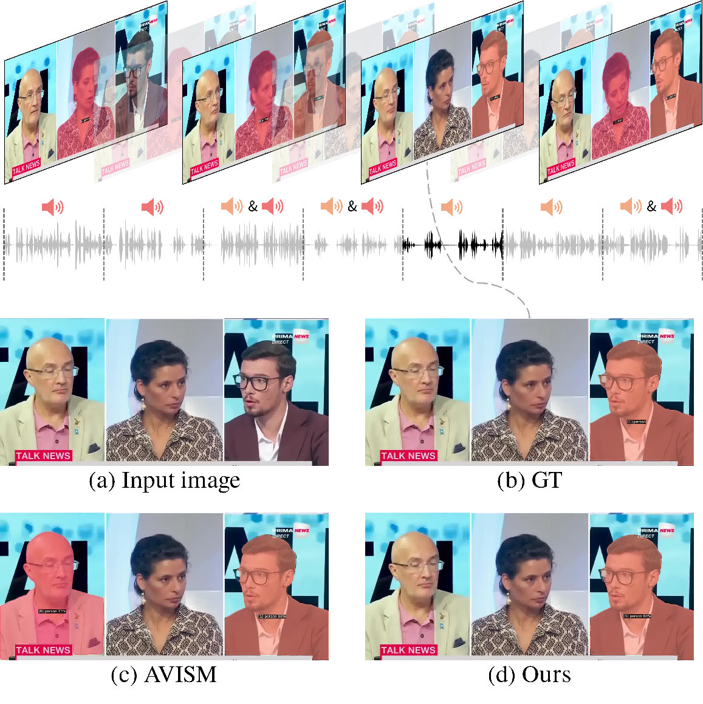

# Learning What To Hear: Boosting Sound-Source Association For Robust Audiovisual Instance Segmentation

Jinbae Seo, Hyeongjun Kwon, Kwonyoung Kim, Jiyoung Lee and Kwanghoon Sohn

[](https://arxiv.org/abs/2509.22740)
[](https://huggingface.co/spaces/jinbae-s/ACVIS)

<div align='center'>

</div>

## Demo
<div align="center">

https://github.com/user-attachments/assets/e1e72e81-0945-442a-b6d8-c552c6beae62

https://github.com/user-attachments/assets/1e872233-6934-41dc-8553-56405b54ae56

https://github.com/user-attachments/assets/d35820fb-6173-461d-ab75-9aa0f8f693c8

https://github.com/user-attachments/assets/f6530e52-5871-45f6-a538-8292865c152a

</div>

## Installation

```bash
conda create --name acvis python=3.8 -y
conda activate acvis

conda install pytorch==2.2.2 torchvision==0.17.2 torchaudio==2.2.2 pytorch-cuda=12.1 -c pytorch -c nvidia -y
pip install -U opencv-python
python -m pip install 'git+https://github.com/facebookresearch/detectron2.git'
pip install -r requirements.txt
pip install timm

cd mask2former/modeling/pixel_decoder/ops
sh make.sh
```

## Setup

### Datasets

Download and unzip [AVISeg datasets](https://ruohaoguo.github.io/avis/) and put them in `./datasets`.

### Pretrained Backbones

Download and unzip pre-trained backbones [OneDrive](https://1drv.ms/u/c/3c9af704fb61931d/ETDDliQ8zZFGmYxlLVPyi3sBis_fdjX0w8mJhyQnYVSdXA?e=Wt7pUb) and put them in `./pre_models`.

### Checkpoints

Download the following checkpoints and put them in `./checkpoints`.

| Backbone | Pre-trained Datasets | mAP | HOTA | FSLA | Model Weight |
| --- | --- | --- | --- | --- | --- |
| ResNet-50 | ImageNet | 42.01 | 62.04 | 42.43 | [ACVIS_R50_IN.pth](https://drive.google.com/file/d/1CpnXnMAFuoiQe1C-xWz4BHFXsuL3nFrh/view?usp=sharing) |
| ResNet-50 | ImageNet & COCO | 46.64 | 65.02 | 46.72 | [ACVIS_R50_COCO.pth](https://drive.google.com/file/d/1TXZg2nDtRyhAJijnG8SXv4aqyNlcl_nc/view?usp=sharing) |

## Getting Started

### Train

```
python train_net.py --num-gpus 2 --config-file configs/acvis/acvis_saoc.yaml
```

### Evaluation

```
python train_net.py --config-file configs/acvis/acvis_saoc.yaml --eval-only MODEL.WEIGHTS checkpoints/ACVIS_R50_COCO.pth
```

### Demo

```
python demo_video/demo.py --config-file configs/acvis/acvis_saoc.yaml --opts MODEL.WEIGHTS checkpoints/ACVIS_R50_COCO.pth
```

## Citation

```
@misc{seo2025acvis,
      title={Learning What To Hear: Boosting Sound-Source Association For Robust Audiovisual Instance Segmentation}, 
      author={Jinbae Seo and Hyeongjun Kwon and Kwonyoung Kim and Jiyoung Lee and Kwanghoon Sohn},
      year={2025},
      eprint={2509.22740},
      archivePrefix={arXiv},
      primaryClass={eess.AS},
      url={https://arxiv.org/abs/2509.22740}, 
}
```

## Acknowledgement

Our implementation is based on [Detectron2](https://github.com/facebookresearch/detectron2), [Mask2Former](https://github.com/facebookresearch/MaskFormer), [VITA](https://github.com/sukjunhwang/VITA) and [AVIS](https://github.com/ruohaoguo/avis). Thanks for their great works.
